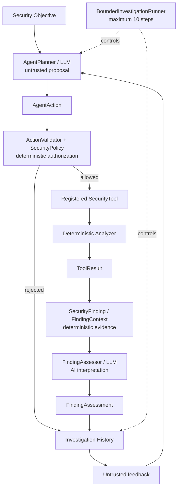

# AutoSec-AI

## Policy-Gated Agentic AI for Automotive Cybersecurity Assessment

AutoSec-AI is an engineering prototype exploring how agentic AI can coordinate automotive security analysis while deterministic policy controls which tools are permitted to execute. The implementation covers source-code security analysis, binary imported-symbol inspection, simulated CAN/UDS diagnostic analysis, deterministic UDS fuzzing, AI-assisted finding assessment, and bounded closed-loop investigation. These capabilities have deliberately different levels of scope and maturity.

**Status:** Functional engineering prototype with a reproducible controlled end-to-end investigation workflow and automated test suite.

## Core Security Principle

> **The model proposes. Deterministic policy decides.**

LLM output is untrusted. `AgentPlanner` converts an LLM response into an `AgentAction`; `ActionValidator` and `SecurityPolicy` determine whether that proposal is authorized; only registered and authorized `SecurityTool` instances execute. Deterministic findings and evidence remain separate from `FindingAssessment`, which is AI interpretation only. An assessment cannot grant execution authority.

## Architecture



The planner and assessor are AI-facing boundaries. Policy, registered tools, analyzers, findings, evidence, and termination decisions are deterministic application components. Historical results and assessments may inform a later proposal, but they cannot modify policy or bypass validation.

See [the detailed architecture model](docs/architecture/architecture.md) for the component model, investigation sequence, trust boundaries, and termination semantics.

## Implemented Capabilities

| Capability | Implementation |
|---|---|
| Agentic investigation orchestration | Planner, validator, tool execution, history, and bounded runner. |
| Policy-gated execution | Tool, target, parameter-value, and numeric-limit validation. |
| OpenAI integration | Optional `OpenAIClient` using the Responses API. |
| Semgrep source analysis | JSON result normalization through `SemgrepAnalyzer`. |
| Automotive C rule pack | One bundled `strcpy` rule with CWE-120 metadata. |
| Binary analysis | `nm -u` imported-symbol inspection for selected `strcpy` symbols. |
| Simulated CAN/UDS | In-memory ECU, classic CAN data model, and UDS simulator. |
| Diagnostic access-control analysis | Simulated protected-DID policy check. |
| Deterministic UDS fuzzing | Fixed, bounded mutation cases against the simulator. |
| Normalized evidence | `SecurityFinding`, `NormalizedEvidence`, and `FindingContext`. |
| AI finding assessment | Strict structured interpretation through `FindingAssessor`. |
| Closed-loop feedback | Historical investigation data is supplied to later planner calls. |
| Bounded execution | Maximum configured autonomous investigation bound of 10 steps. |
| Terminal/JSON reporting | Sanitized terminal output and stable JSON reports. |
| Execution evaluation | Counts execution behavior; it is not a risk or accuracy score. |

## Controlled End-to-End Demonstration

The reproducible source demonstration runs:

```text
python -m autosec_ai.cli source-demo
```

against `tests/fixtures/ecu_vulnerable.c`. Its actual path is:

```text
planner proposal
	-> policy validation
	-> Semgrep
	-> trusted automotive rule pack
	-> deterministic CWE-120 finding
	-> FindingContext
	-> AI assessment
	-> bounded termination
	-> report
```

The demo uses real Semgrep analysis and deterministic `MockLLMClient` responses by default. It does not require an API key or network access, and it does not interact with a real vehicle.

Representative output:

```text
Authorization: ALLOWED
Tool result: success
Rule: rules.semgrep.autosec-c-unsafe-strcpy
CWE: CWE-120
Classification: needs_review
Confidence: medium
Termination: MAX_STEPS_REACHED
```

`Classification` and `Confidence` are AI interpretation fields; they do not establish exploitability.

## Installation

The project requires Python `>=3.11,<3.13`.

```bash
git clone <repository-url>
cd AutoSec-AI-Project
python3.11 -m venv .venv
source .venv/bin/activate
python -m pip install --upgrade pip
python -m pip install -e ".[dev]"
```

The editable install provides the declared Python dependencies, including `openai` and development `pytest`. The source demonstration also requires the `semgrep` executable. Semgrep is not declared as a Python project dependency; install it separately according to the local environment, for example:

```bash
python -m pip install semgrep
	semgrep --version
```

After Semgrep is installed and available, run the controlled source demonstration with `python -m autosec_ai.cli source-demo`. Binary imported-symbol inspection requires the platform `nm` utility. No Homebrew-specific installation is assumed. The implementation is intended for controlled macOS/Linux development environments, subject to the availability and behavior of those platform tools.

## Running the Demos

```bash
python -m autosec_ai.cli --help
python -m autosec_ai.cli report-demo
python -m autosec_ai.cli report-demo --json
python -m autosec_ai.cli source-demo
python -m autosec_ai.cli source-demo --json
```

`report-demo` presents a simulated rejected investigation record and does not run security analysis. `source-demo` runs the real controlled Semgrep pipeline against the ECU fixture, with mock planner and assessor responses.

## Optional OpenAI Integration

`OpenAIClient` reads:

- `OPENAI_API_KEY` for authentication
- `OPENAI_MODEL` for optional model selection

The default source demonstration does not construct `OpenAIClient`; it uses deterministic `MockLLMClient` instances so the workflow is reproducible without API or network access.

## Automotive Security Components

### Source

`SemgrepAnalyzer` runs Semgrep JSON output through a trusted logical rule-pack mapping. The bundled automotive C pack currently detects `strcpy(...)` and reports CWE-120 metadata.

### Binary

`ImportedFunctionBinaryAnalyzer` runs `nm -u` and recognizes `_strcpy` and `___strcpy_chk`. The resulting finding is imported-symbol evidence only; it is not full binary vulnerability analysis.

### Vehicle

The automotive layer contains an in-memory ECU and classic CAN data model. The simulator supports UDS `ReadDataByIdentifier` (`0x22`), a synthetic VIN DID (`0xF190`), a protected DID (`0xF1A0`), and a diagnostic authorization model. No real CAN, ISO-TP, ECU, network, or vehicle communication is used.

### Fuzzing

The UDS fuzzer executes a small deterministic set of malformed and boundary mutations against the simulator. It is bounded and simulator-only, not random high-volume real-vehicle fuzzing.

## Evidence vs AI Interpretation

The deterministic layer contains:

- `SecurityFinding`: normalized analyzer output
- `NormalizedEvidence`: factual observations from a tool or simulator
- `FindingContext`: a finding plus normalized evidence

The AI layer contains `FindingAssessment`, with these classifications:

- `confirmed_vulnerability`
- `likely_vulnerability`
- `needs_review`
- `likely_false_positive`

An assessment is interpretation of supplied evidence. It does not prove exploitability and cannot authorize a future action.

## Security Design

The prototype uses:

- registered security tools
- tool and target allow-lists
- exact allowed parameter values
- numeric/resource limits
- trusted logical rule-pack mapping through `RulePackRegistry`
- subprocess argument lists without `shell=True`
- a maximum autonomous bound of 10 steps
- `TOOL_ERROR` for executed non-success `ToolResult` statuses
- fail-loud propagation of unexpected runtime exceptions
- explicit untrusted-data boundaries around historical evidence and assessments

See [docs/architecture/threat-model.md](docs/architecture/threat-model.md) for the prototype threat model.

## Evaluation

`InvestigationEvaluation` reports execution behavior using:

`total_steps`, `allowed_actions`, `rejected_actions`, `executed_actions`, `successful_tool_executions`, `failed_tool_executions`, `deterministic_findings`, `ai_assessments`, and `termination_reason`.

These metrics are not AI accuracy, CVSS, risk scoring, exploitability measurement, or security assurance.

## Test Status

The current prototype has **193 tests currently passing in the verified development environment**. Run them with:

```bash
pytest
```

Representative areas include policy enforcement, authorization rejection, malformed LLM output, parameter validation, prompt-injection resistance, bounded execution, tool failures, evidence provenance, hostile AI assessment, reporting behavior, and the controlled end-to-end source investigation. No coverage percentage is claimed because a coverage report is not currently part of the project.

## Limitations

This is an engineering prototype, not a production platform.

- CAN/UDS behavior is simulated and in-memory.
- There is no real CAN, ISO-TP, ECU, network, or vehicle communication.
- Source analysis uses a narrow custom rule pack.
- The source demo processes only the first deterministic finding.
- Binary analysis is imported-symbol inspection only.
- Fuzzing is deterministic, bounded, and simulator-only.
- The default reproducible demo uses mock LLM responses.
- AI assessment does not establish exploitability.
- There is no production authentication, persistent database, distributed execution, or production sandbox.
- There is no CVSS, risk, or AI-accuracy scoring.

## Project Structure

```text
src/autosec_ai/
	agents/       orchestration, validation, policy, and investigation state
	analyzers/    source, binary, vehicle, fuzz, finding, and evidence analysis
	application/  controlled source-demo composition
	automotive/   ECU, CAN, UDS, simulator, probe, and fuzz models
	llm/          provider interface, mock client, and OpenAI client
	reporting/    investigation report models and formatters
	tools/        registered security tools and external process boundary
	evaluation.py execution-behavior metrics
	cli.py        terminal entry points
tests/          unit and integration tests, including security fixtures
rules/          trusted Semgrep rule packs
```

## Future Work

Potential future work, not implemented here:

- broader source rule coverage
- richer binary analysis and disassembly integration
- controlled SocketCAN/ISO-TP adapters
- broader UDS service modeling
- multi-finding processing
- stronger execution sandboxing
- persistent investigation artifacts
- analyst-facing UI
- evaluation against larger automotive test corpora

The project is intended for authorized security research, education, and testing in controlled environments.
