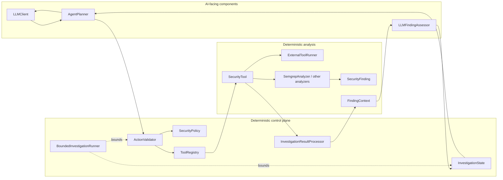
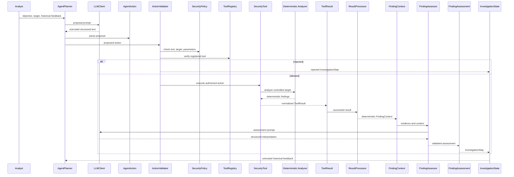

# AutoSec-AI Architecture

## 1. Purpose and Scope

AutoSec-AI is an engineering prototype for controlled, policy-gated automotive cybersecurity assessment. It demonstrates how an LLM can propose investigation actions while deterministic application code controls authorization, tool execution, evidence handling, bounded termination, and reporting.

The architecture covers source-code analysis, selected binary imported-symbol inspection, simulated CAN/UDS analysis, deterministic UDS fuzzing, AI finding assessment, and investigation reporting. It does not provide real vehicle communication, production deployment, or comprehensive vulnerability analysis.

## 2. Architectural Principles

- LLM output is an untrusted proposal or interpretation.
- Deterministic policy decides whether an action may execute.
- Only registered security tools execute.
- Security findings and evidence remain distinct from AI assessments.
- Every autonomous iteration is bounded and independently validated.
- Trusted rule-pack paths are application configuration, not LLM input.
- Unexpected runtime exceptions propagate rather than being silently reclassified.
- The default source demonstration is reproducible without API access.

## 3. Component Diagram

The AI-facing components generate proposals and interpretations. The control plane owns authorization and lifecycle state. Deterministic tools and analyzers produce observations. `BoundedInvestigationRunner` controls the maximum number of new steps.

## 4. Investigation Sequence

`BoundedInvestigationRunner` surrounds repeated calls to the one-step orchestrator. It does not create a completion action.

## 5. Component Responsibilities

### `agents/`

- `AgentAction` represents a proposed tool, target, and parameter mapping.
- `AgentPlanner` converts LLM text into an action without authorizing or executing it.
- `SecurityPolicy` stores allowed tools, targets, parameter values, and numeric limits.
- `ActionValidator` performs deterministic authorization.
- `InvestigationOrchestrator` performs one proposal, validation, execution, processing, and assessment step.
- `InvestigationState` and `InvestigationStep` retain immutable ordered history.
- `BoundedInvestigationRunner` enforces the configured maximum.
- `InvestigationResultProcessorRegistry` maps tool names to trusted processors.
- `AgentState` and `AgentOrchestrator` are retained legacy/internal components described below.

### `tools/`

`SecurityTool` defines the tool contract. `ToolRegistry` stores tools by unique name. `ToolResult` normalizes status and output. `ExternalToolRunner` invokes known external executables using argument lists and timeouts. `SemgrepSecurityTool` adapts `SemgrepAnalyzer` to the tool contract.

### `analyzers/`

Analyzers normalize source, binary, vehicle, and fuzz observations into `SecurityFinding` objects. Context adapters produce normalized factual evidence. `FindingAssessor` implementations interpret supplied context but do not authorize actions.

### `automotive/`

This package contains validated ECU, CAN, and UDS value objects, an in-memory deterministic ECU simulator, diagnostic policy models, one-probe evidence, and deterministic bounded UDS fuzz cases.

### `llm/`

`LLMClient` is provider-neutral. `MockLLMClient` provides deterministic responses. `OpenAIClient` uses the OpenAI Responses API and reads `OPENAI_API_KEY` and optional `OPENAI_MODEL`.

### `reporting/`

Reporting converts `InvestigationRunResult` into report models and formats terminal-safe text or stable JSON. Reporting is presentation-only and does not execute tools or call an LLM.

### `application/`

`source_demo.py` is the application composition root for the controlled source investigation. It wires the trusted rule pack, Semgrep tool, mock planner and assessor, policy, processor, orchestrator, and one-step runner.

### `evaluation.py`

`evaluate_investigation()` counts execution behavior from an `InvestigationRunResult`. It does not calculate vulnerability risk, exploitability, CVSS, AI accuracy, or security quality.

### `cli.py`

The CLI presents `report-demo` and `source-demo` output. It delegates composition to the application module rather than constructing all security components itself.

## 6. Trust Boundaries

1. **LLM to `AgentAction`:** LLM text is parsed and treated as an untrusted proposal.
2. **Proposal to execution:** `ActionValidator` and `SecurityPolicy` must allow the action before registry execution.
3. **Tool output to `FindingContext`:** processors use deterministic tool output; they do not execute tools or call an LLM.
4. **`FindingContext` to assessor:** evidence is serialized as untrusted analysis input and cannot authorize actions.
5. **History to planner:** feedback is untrusted historical data and cannot bypass future validation.
6. **Application to trusted configuration:** the application chooses registered tools, targets, and rule-pack mappings.

## 7. Authorization Model

Authorization requires all relevant checks to pass:

- the tool exists in `ToolRegistry`;
- the tool name is in `SecurityPolicy.allowed_tools`;
- the target is in `allowed_targets`;
- only configured parameter names are present;
- required parameter values belong to the configured allow-list;
- numeric values do not exceed configured limits.

The source demo maps the logical name `automotive` to the repository rule file through `RulePackRegistry`. The planner cannot provide an arbitrary Semgrep path or arbitrary Semgrep arguments.

## 8. Evidence Model

`SecurityFinding` is deterministic normalized analyzer output. `NormalizedEvidence` captures factual observations from binary, vehicle, or fuzz analysis. `FindingContext` combines one finding with normalized evidence. `format_finding_context()` uses structured JSON and explicit untrusted-data instructions before an assessor receives the context.

`FindingAssessment` is separate AI interpretation with validated classification, confidence, rationale, impact, and recommendations. It does not become evidence and has no execution authority.

## 9. Closed-Loop Investigation Lifecycle

1. The objective and target enter `InvestigationState`.
2. `AgentPlanner` receives the objective, target, and prior feedback.
3. The planner returns an `AgentAction` proposal.
4. `ActionValidator` checks the action against the registry and policy.
5. A permitted tool executes against its controlled target.
6. The tool returns a `ToolResult`.
7. A registered result processor may create `FindingContext`.
8. A configured assessor may create `FindingAssessment`.
9. The complete `InvestigationStep` is appended to immutable history.
10. Historical output can be supplied to a later planner proposal, but the next action is independently validated.

The controlled source demo intentionally runs one step and terminates at the bound.

## 10. Termination Semantics

- `MAX_STEPS_REACHED`: the configured number of steps completed without rejection or a non-success tool status.
- `ACTION_REJECTED`: validation disallowed the proposed action; the tool is not executed.
- `TOOL_ERROR`: an executed tool returned a `ToolResult` whose status is not `success`.

Exceptions from `tool.execute()`, result processors, and assessors are not converted into `TOOL_ERROR`; they propagate to the caller. This is fail-loud behavior for unexpected implementation/runtime failures.

The global configured maximum is `MAX_INVESTIGATION_STEPS = 10`. The source demo uses `max_steps=1`.

## 11. Reporting Architecture

`build_investigation_report()` transforms the run result into immutable report models. Parameters receive recursive immutable snapshots. The terminal formatter removes ANSI and other control sequences from displayed values. The JSON formatter emits stable sorted-key JSON while preserving separate deterministic-finding and AI-assessment sections.

Reporting does not call `SecurityTool`, `ExternalToolRunner`, `AgentPlanner`, or `FindingAssessor`.

## 12. Controlled Source-Demo Composition

The source demo assembles:

- `MockLLMClient` for the planner
- `AgentPlanner`
- `ToolRegistry`
- `SemgrepSecurityTool` backed by `SemgrepAnalyzer`
- trusted `RulePackRegistry`
- `SecurityPolicy` allowing only `semgrep`, the ECU fixture, and `automotive`
- `ActionValidator`
- `SourceFindingResultProcessor`, selecting the first deterministic finding
- `LLMFindingAssessor` backed by deterministic `MockLLMClient`
- `InvestigationOrchestrator`
- `BoundedInvestigationRunner(max_steps=1)`

The CLI presents the resulting report. It does not use OpenAI by default and does not interact with a vehicle.

## 13. Legacy Architecture Note

`AgentState` and `AgentOrchestrator` remain in `agents/state.py` and `agents/orchestrator.py`. They are imported and tested as foundation code for the older mutable execution path. They are not used by the current immutable `InvestigationOrchestrator`, `BoundedInvestigationRunner`, or controlled source-demo path. They should be treated as legacy/internal until a later cleanup decides whether to mark or remove them.

## 14. Known Architectural Limitations

- The source demo processes only the first deterministic finding.
- The automotive layer is simulated and in-memory.
- Binary analysis is selected imported-symbol inspection, not full binary analysis.
- The bundled source rule pack is narrow.
- No real CAN, ISO-TP, ECU, network, or hardware integration exists.
- The default demonstration uses mock LLM responses.
- There is no production sandbox, authentication, persistence, distributed execution, or analyst UI.
- `SecurityPolicy` is a mutable object retained by the orchestrator.
- Unexpected runtime exceptions propagate from the bounded investigation path.
- The report intentionally presents a compact summary rather than all raw evidence and tool data.
